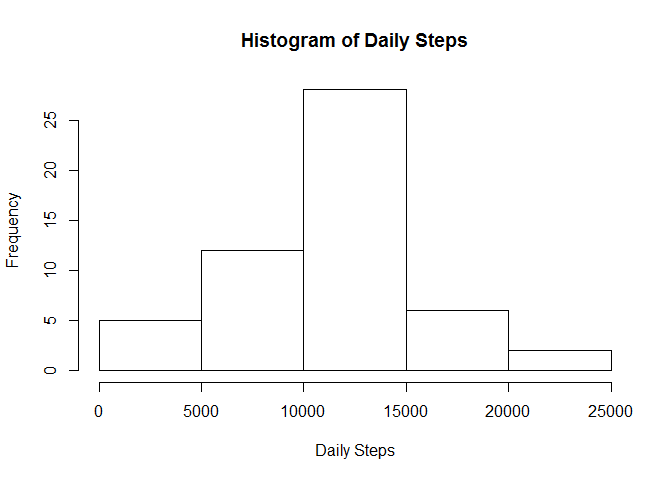
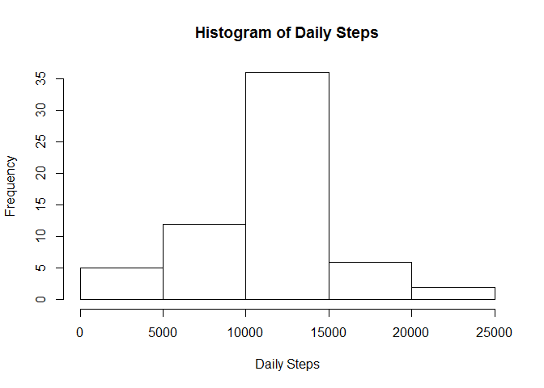

# Reproducible Research: Peer Assessment 1


## Loading and preprocessing the data

Load all of the packages required for the analysis.


```r
library(dplyr)
```

```
## 
## Attaching package: 'dplyr'
```

```
## The following objects are masked from 'package:stats':
## 
##     filter, lag
```

```
## The following objects are masked from 'package:base':
## 
##     intersect, setdiff, setequal, union
```

```r
library(stringr)
library(lubridate)
```

```
## 
## Attaching package: 'lubridate'
```

```
## The following object is masked from 'package:base':
## 
##     date
```

```r
library(lattice)
```

Loads the data, combines the date and time into a single variable called dateTime, and converts it to a POSIXct class.


```r
activityClasses <- c("integer", "character", "character")
activity <- read.csv("activity.csv", colClasses = activityClasses)
activity$interval <- paste("000", activity$interval, sep = "")
activity$interval <- str_sub(activity$interval, start = -4)
activity$dateTime <- ymd_hm(paste(activity$date, activity$interval))
```

## What is mean total number of steps taken per day?

Make a histogram of the total number of steps taken each day.


```r
dailySteps <- aggregate(steps ~ date, activity, sum)
hist(dailySteps[,2], main = "Histogram of Daily Steps", xlab = "Daily Steps")
```

<!-- -->

```r
meanSteps <- round(mean(dailySteps[,2]))
medianSteps <- median(dailySteps[,2])
```

The mean number of daily steps was 1.0766\times 10^{4}. The median number of daily steps was 10765.

## What is the average daily activity pattern?

Make a time series plot of the  average number of steps taken in each interval.


```r
intervalSteps <- aggregate(steps ~ interval, activity, mean)
with(intervalSteps, plot(interval, steps, type ="l"))
```

<!-- -->

```r
maxSteps <- top_n(intervalSteps, 1, steps)[,1]
```

The most steps were taken, on average, at 0835.

## Imputing missing values

Calculate missing values by inserting the mean number of steps for that interval.


```r
nas <- table(is.na(activity$steps))[2]
completeActivity <- activity
for(x in 1:nrow(completeActivity)){
    if(is.na(completeActivity$steps[x])){
        numSteps <- subset(intervalSteps, interval == completeActivity$interval[x])
        completeActivity$steps[x] <- numSteps[,2]
    }
}
completeDailySteps <- aggregate(steps ~ date, completeActivity, sum)
hist(completeDailySteps[,2], main = "Histogram of Daily Steps", xlab = "Daily Steps")
```

<!-- -->

```r
completeMeanSteps <- mean(completeDailySteps[,2])
completeMedianSteps <- median(completeDailySteps[,2])
```

There are 2304 NAs in the dataset. After imputing missing values, the mean number of daily steps was 1.0766189\times 10^{4}. The median number of daily steps was 1.0766189\times 10^{4}. There was very little change to the mean and median because entire days of missing data were replaced with the average data. Therefore the averages were not pulled away from where they started.

## Are there differences in activity patterns between weekdays and weekends?

Create a new factor variable that splits days into either a "weekday" or a "weekend". Then compare the average number of steps for each interval between the two sets of days.


```r
activity <- mutate(activity, weekday = weekdays(activity$dateTime))
weekendGroup <- c("Saturday", "Sunday")
for(x in 1:nrow(activity)){
    if(activity$weekday[x] %in% weekendGroup){
        activity$weekend[x] <- "weekend"
    } else{
        activity$weekend[x] <- "weekday"
    }
}
activity$weekend <- as.factor(activity$weekend)
intervalSteps <- aggregate(steps ~ interval+weekend, activity, mean)
intervalSteps$interval <- as.numeric(intervalSteps$interval) 
with(intervalSteps, xyplot(steps ~ interval | weekend, type ="l", layout = c(1,2)))
```

<!-- -->

